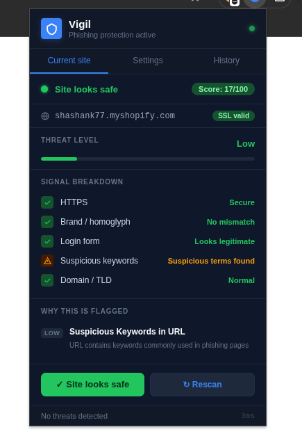
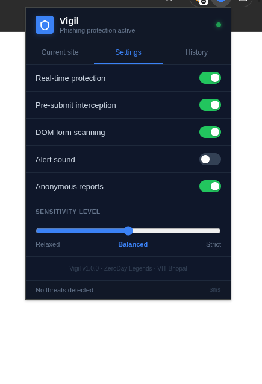

# 🛡️ Vigil — AI-Powered Phishing Detection

> Always watching. So you don't have to.

**Built by ZeroDay Legends · VIT Bhopal · NextGen 2026**

---

##  Preview

                  


---

##  How It Works

```
Browser Tab
    │
    ▼
content.js          — extracts 14 DOM signals from the live page
    │                      (chrome.runtime.sendMessage)
    ▼ 
background.js       — service worker proxies the API call to bypass
    │                  Chrome's Private Network Access restriction
    ▼
FastAPI /analyze    — extracts 50 features from URL + DOM
    │
    ▼
XGBoost Model       — outputs probability 0.0 → 1.0
    │
    ▼
Popup UI            — threat score, signal breakdown, flags, history
```

1. When you visit any page, the content script extracts **14 DOM signals** — login forms, hidden inputs, obfuscated JS, favicon mismatches, form action domain mismatches, and more
2. The background service worker proxies the request to the FastAPI backend (necessary due to Chrome's Private Network Access policy — more on this in Problems Faced)
3. The backend extracts **50 features** across URL structure, SSL certificate, and DOM content
4. XGBoost outputs a **threat score 0–100** with human-readable flags explaining exactly why a page is suspicious
5. If score exceeds 60, form submission is **intercepted** and a warning modal blocks the user before any credentials leave the browser

---

## 🏗️ Project Structure

```
vigil/
├── README.md
├── railway.json                  # Railway deployment config
│
├── backend/
│   ├── app.py                    # FastAPI server + threat flag generator
│   ├── features.py               # 50-feature extractor (URL + SSL + DOM)
│   ├── build_dataset_v3.py       # Synthetic dataset builder (10k samples)
│   ├── train_model.py            # XGBoost trainer with early stopping
│   ├── requirements.txt
│   ├── Dockerfile
│   └── model/
│       ├── vigil_model.json      # Trained XGBoost model 
│       ├── scaler.pkl            # StandardScaler for feature normalization
│       └── model_meta.json       # Metrics, feature names, top features
│
└── extension/
    ├── manifest.json             # Chrome MV3 manifest
    ├── background.js             # Service worker — API proxy + badge
    ├── content.js                # DOM extraction + form intercept + modal
    ├── popup.html / css / js     # Extension popup UI
    └── icons/
```

---

## ✨ Features

- **Real-time scanning** — every page analyzed ~800ms after load
- **50 ML features** — URL entropy, homoglyph detection, SSL age, DOM signals, brand impersonation
- **Explainable flags** — tells you exactly why a site was flagged, not just a score
- **Pre-submit interception** — blocks form submission on high-risk pages before credentials are sent
- **Threat history** — session log of every scanned site with scores
- **Sensitivity control** — Relaxed / Balanced / Strict detection modes
- **Badge indicator** — extension icon shows live threat score per tab
- **Zero data retention** — all analysis is ephemeral, nothing stored remotely

---

##  Quick Start

### 🌐 Option 1: Use Hosted Backend (Recommended)

No setup required — backend is already deployed.

The extension connects to:
https://vigil.up.railway.app/

#### Steps:

1. Clone the repo
```bash
git clone https://github.com/shekh-2810/VIGIL.git
cd VIGIL
```
2.Load the Chrome extension

- Go to chrome://extensions

- Enable Developer mode

- Click Load unpacked → select the extension/ folder

- Pin the Vigil icon

 Done — extension works instantly without running backend

### 🛠️ Option 2: Run Backend Locally (Development)

Use this if you want to modify or debug the backend.

1. Clone the repo
```bash
git clone https://github.com/shekh-2810/VIGIL.git
cd VIGIL
```
2. Start the backend
```
cd backend
pip install -r requirements.txt
uvicorn app:app --host 0.0.0.0 --port 8000 --reload
```
 Verify:
```
curl http://127.0.0.1:8000/health
# → {"status":"ok","model_loaded":true}
```
3. Point extension to local backend

 Open DevTools in extension popup → Console:
```
localStorage.setItem("VIGIL_BACKEND", "http://127.0.0.1:8000");
```
4. Load the extension
```
Go to chrome://extensions

Enable Developer mode

Click Load unpacked → select extension/

Reload extension
```
🔁 Switch back to hosted backend
```
localStorage.setItem("VIGIL_BACKEND", "https://vigil.up.railway.app");
```
⚠️ Notes:

Hosted backend may have cold start delay (2–5s)
Local backend is faster and no rate limits
Do not run both simultaneously unless switching endpoints
---

##  ML Model Details

| Property | Value |
|---|---|
| Algorithm | XGBoost (gradient boosted trees) |
| Total features | 50 |
| Training samples | 6,000 |
| Precision | **0.9987** |
| Recall | **0.9947** |
| F1-Score | **0.9967** |
| AUC-ROC | **1.00** |
| CV F1 (5-fold) | 0.9978 ± 0.0006 |
| Best iteration | 492 / 500 (early stopping) |

### Top 10 feature importances

| Feature | Importance |
|---|---|
| num_hidden_inputs | 10.83% |
| unusual_tld | 10.72% |
| has_obfuscated_js | 8.73% |
| suspicious_keyword_count | 8.21% |
| form_action_mismatch | 8.17% |
| uses_https | 7.60% |
| query_length | 7.36% |
| is_url_shortener | 4.72% |
| has_right_click_disabled | 4.29% |
| has_external_form_action | 4.29% |

Importance is spread across 10 features — no single feature dominates. This is the key sign of a generalizing model vs. an overfit one (our first model had 2 features at 97% combined importance).

### Feature categories

**URL (32):** length, entropy, subdomain depth, hyphen count, digit count, IP address usage, hex encoding, HTTPS, suspicious keywords, homoglyph detection, brand impersonation in subdomain/path, TLD risk, URL shortener, query string analysis

**SSL (4):** certificate validity, days remaining, certificate age, is-new-cert flag

**DOM (14):** password fields, login forms, hidden inputs, form action domain mismatch, external form action, favicon mismatch, copyright text, iframe count, obfuscated JS, external link ratio, right-click disabled, popup detection

---

## 🛡️ Threat Score Interpretation

| Score | Level | Action |
|---|---|---|
| 0 – 29 | 🟢 Safe | No action |
| 30 – 59 | 🟡 Suspicious | Warning shown in popup |
| 60 – 79 | 🔴 Dangerous | Form submission blocked |
| 80 – 100 | 🚨 Critical | Immediate block + full-screen modal |

---
##  Design Decisions & Why

### Why XGBoost instead of LLMs or APIs?

- **LLMs (GPT, etc.)** were rejected due to high latency (500ms–3s), cost per request, and privacy risks — sending every visited URL to external services is unacceptable for a security tool.
- **Reputation APIs (VirusTotal, Google Safe Browsing)** only detect *known* threats. Zero-day phishing pages easily bypass them.
- **XGBoost on structured features** provides:
  - ~2ms inference
  - no third-party dependency
  - strong zero-day detection
  - full explainability (clear signal-based reasoning)

---

### Why synthetic dataset over public datasets?

- **Stale labels:** Public datasets are snapshots; URLs may no longer reflect reality.
- **Geographic mismatch:** Lack of Indian phishing patterns (SBI, UPI, Paytm scams).
- **Feature mismatch:** Public datasets lack DOM-based features used in this project.

Synthetic generation allowed:
- Controlled attack patterns (8 types)
- Realistic HTTPS usage (~40% phishing)
- Region-specific phishing scenarios
- Full alignment with the 50-feature pipeline

**Tradeoff:** May miss rare real-world edge cases, mitigated by designing patterns from real phishing techniques.

---

##  Problems Faced During Development

### 1. Chrome blocked localhost requests

- **Issue:** Popup showed “Backend offline” despite working API  
- **Cause:** Content scripts cannot access `localhost` due to Chrome Private Network Access restrictions  
- **Fix:** Moved API calls to `background.js` (service worker proxy)

---

### 2. XGBoost API change

- **Issue:** `early_stopping_rounds` error  
- **Cause:** Parameter moved in newer XGBoost versions  
- **Fix:** Shifted it from `.fit()` to the model constructor

---

### 3. Model overfitting (false perfection)

- **Issue:** F1 = 1.0 but model relied on only 2 features  
- **Cause:** Dataset flaw — HTTPS perfectly separated classes  
- **Fix:** Rebuilt dataset:
  - Mixed HTTPS usage
  - Added realistic domain patterns
  - Expanded to 10k samples  

**Result:** F1 = 0.9967 with balanced feature importance

---

## 🧪 Test the API directly local user

```bash
# Safe site
curl -X POST http://127.0.0.1:8000/analyze \
  -H "Content-Type: application/json" \
  -d '{"url":"https://google.com","dom_data":{}}'

# Phishing with DOM signals
curl -X POST http://127.0.0.1:8000/analyze \
  -H "Content-Type: application/json" \
  -d '{
    "url": "http://secure-paypa1-login.xyz/webscr?cmd=login",
    "dom_data": {
      "has_password_field": true,
      "has_login_form": true,
      "has_obfuscated_js": true,
      "num_hidden_inputs": 4,
      "form_action_domain_mismatch": true
    }
  }'

# Debug — see all 50 features the model uses
curl http://127.0.0.1:8000/features
```

---

## 🤝 Contributing

1. Fork the repo
2. Create a feature branch: `git checkout -b feature/my-feature`
3. Commit: `git commit -m 'Add my feature'`
4. Push and open a Pull Request

---


<p align="center">Built with 🛡️ by ZeroDay Legends · VIT Bhopal</p>
